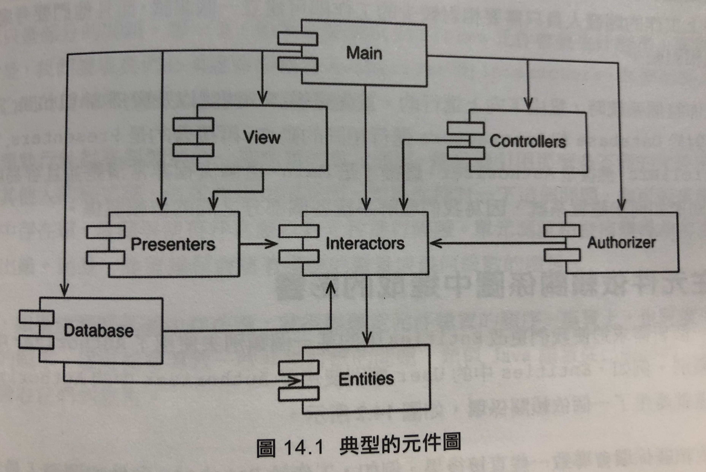
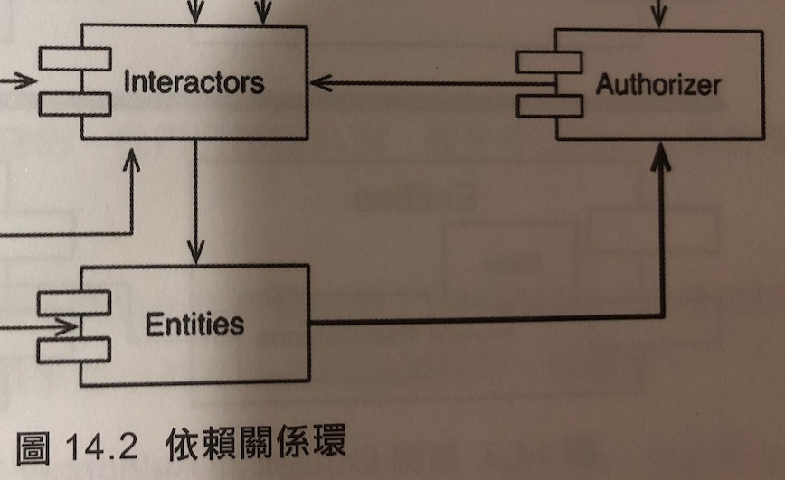
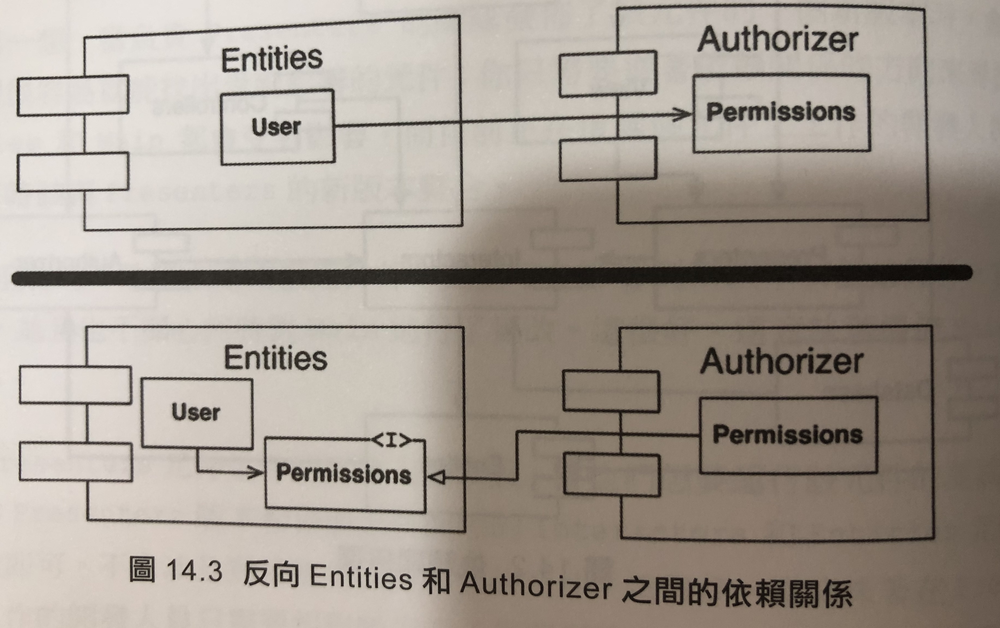
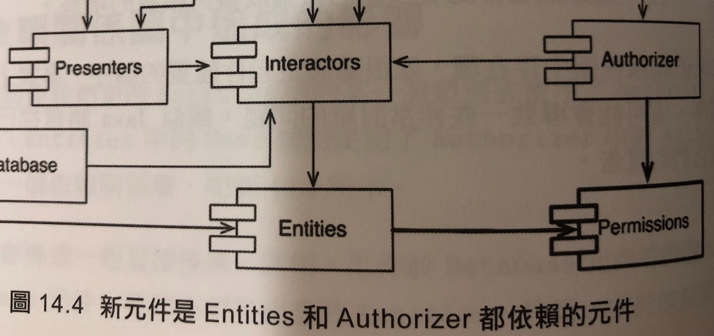

CH14 元件耦合性
=================

# 什麼是元件耦合性？
耦合就是元件之間的依賴關係。

# 三個元件耦合性的原則
1. ADP Acyclic Dependencies Principle 無環依賴原則。
2. SDP Stability Dependencies Principle 穩定依賴原則。
3. SAP Stability Abstractions Principle 穩定抽象原則。

# ADP Acyclic Dependencies Principle 無環依賴原則

## 什麼是無環依賴原則？

元件的依賴結構中不能出現環。

## 什麼是依賴關係環？

A依賴B，B依賴C，C又依賴A，就成了一個環。

## 隔天早上症候群

1. 工作一整天，完成一個功能，上傳，下班。隔天再來公司，更新專案，卻發現昨天做的功能壞掉了。因為昨天下班後有其他同事上傳了其他修改。
2. 當越多人協作同一個專案，做的東西互相依賴，就越有可能會發生這種狀況。
3. 如果元件的依賴結構出現環，就無法避免隔天早上症候群。

## DAG Directed acyclic graph 有向無環圖

1. 箭頭指向依賴的元件。
2. 有向無環圖：無論從哪個元件開始，都無法沿著依賴關係回到開始的元件。

## 一個依賴關係環的例子

## 解除依賴關係環的兩個方法

1. 使用DIP依賴反向原則。
2. 新建一個「兩個元件都依賴」的元件。

## 使用DIP依賴反向原則解除依賴關係環

## 使用新建元件解除依賴關係環

